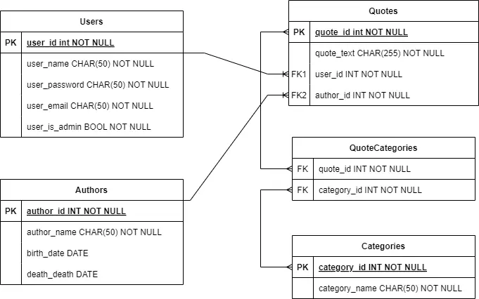
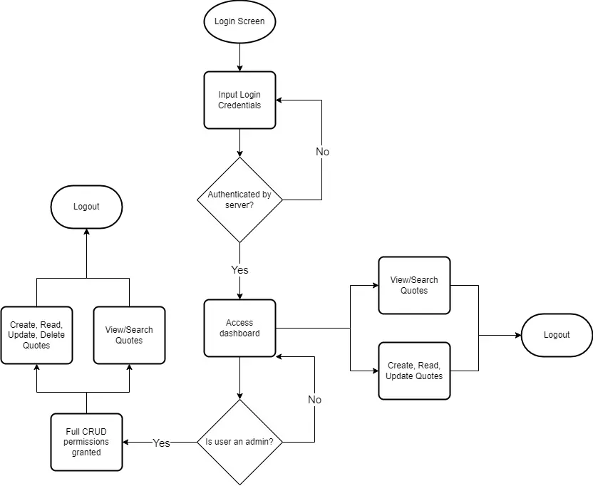

# Quotava – Inspirational quotes for Amazonians based on Leadership Principles.

## Introduction
Quotes can influence a company’s culture; Amazons culture is complex but is largely based around its leadership principles. There are many quotes from notable figures at Amazon, however, Amazonians aspire to raise the bar, the more inspiring quotes employees can look towards when lost, will help them find their way.

# Build & Run the Application

## Server

## Client

# Web App Link

[Quotava](https://www.alexmould.co.uk/quotava)

# Diagrams

### Stack Diagram

### Entity Relationship Diagram

### Process Flow Diagram

### Architecture Diagram
